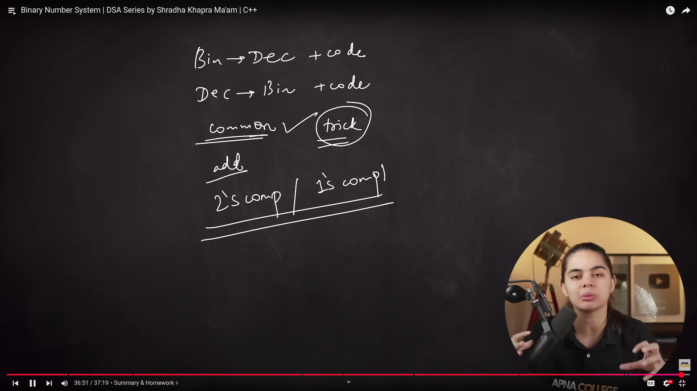

## What was learned in this lecture

Two's compliment

Convert to binary representation
Prefix binary value with 0
Flip all the bits (1's compliment)
Add 1 to the flipped bits (2's compliment)

Ex 2's compliment (representation of -ve num in memory): 
(-8)_10 = (1000)_2

MSB: 01000

1's compliment: 10111

2's compliment: 11000

Reverse: 

Number: 11000

1's compliment: 00111

2's compliment: 01000 (since first digit is 0 num is -ve, rest of them can be used to calculate value 8)

-----
Q. 2's compliment of -12

Binary = 01100 (0 MSB for -ve number)

1's compliment = 10011

2's compliment = 10100

Reverse: 

1's compliment = 01011

2's compliment = 01100 (0 -> -ve; 1100 -> 12)
-12

------------------
Q. +12

Binary = 11100

1's compliment = 00011

2's compliment = 00100

Reverse: 
1's = 11011
2's = 11100