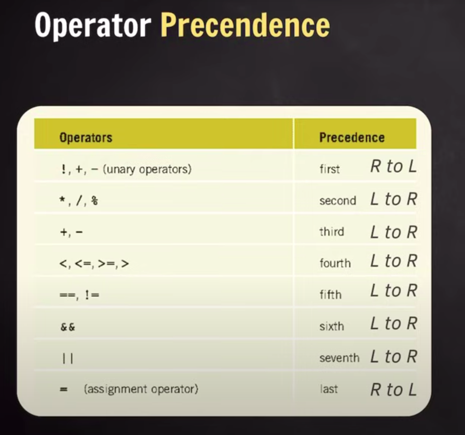
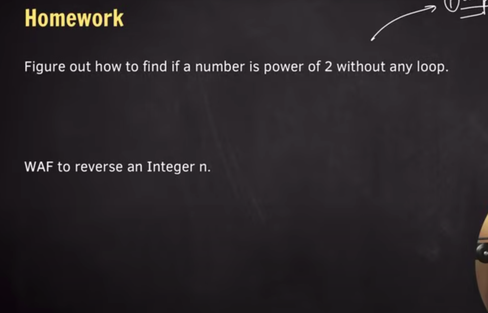

## Bitwise operators

6 & 10
0110 & 1010 = 0010
= 2
----
6 | 10
0110 | 1010 = 1110
=14
----
6 ^ 10
0110 ^ 1010 = 1100
=12
----
10 << 2
1010 << 2 = 1000
= 8 x

10 << 2
1010 << 2
10100 -> 101000
=40
----
10 >> 1
0101
=5
----


## Operator Precedence 



Only assignment and unary operators have right to left
All else have left to right (reading direction)

## Scope

```
side note

Functions have a call stack that has memory assigned to it 
Popped on return
```

Local and Global scope

Global accessible in entire file  

## Data Type modifiers

int has 4 bytes of memory (32 bits)
range of int -2^31 to +2^31 -1 (middle one used for 0, which is all 0s)

long -> ensure >= 4 bytes (long int)
short = 2 bytes (short int)
long long int = 2

## HW

