## Recursion

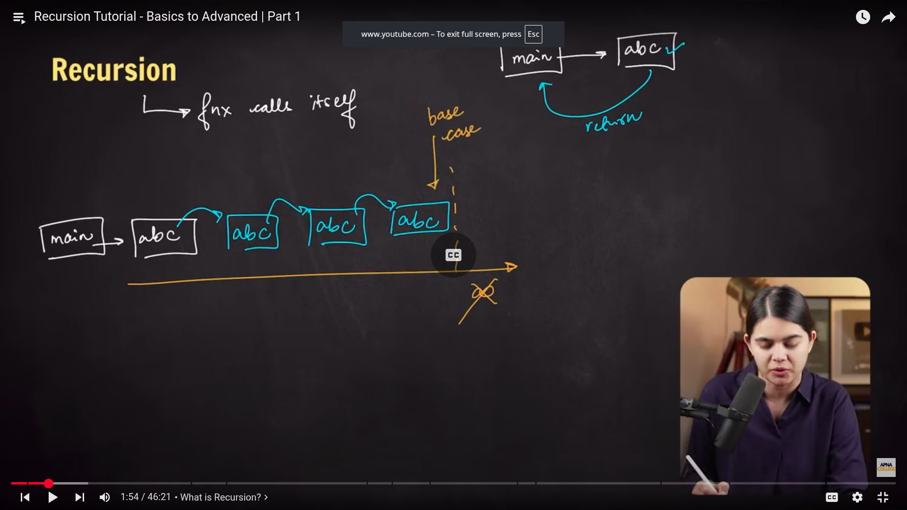

-   All things that we can do with loops, we can also do with recursion
-   but efficiency of a solution will depend on the problem
-   Rule of thumb: Array, vectors -> loops, trees, graphs -> recursion

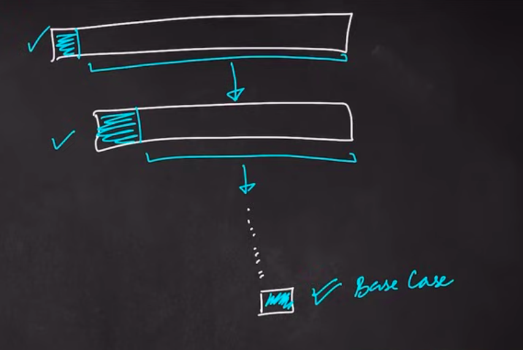

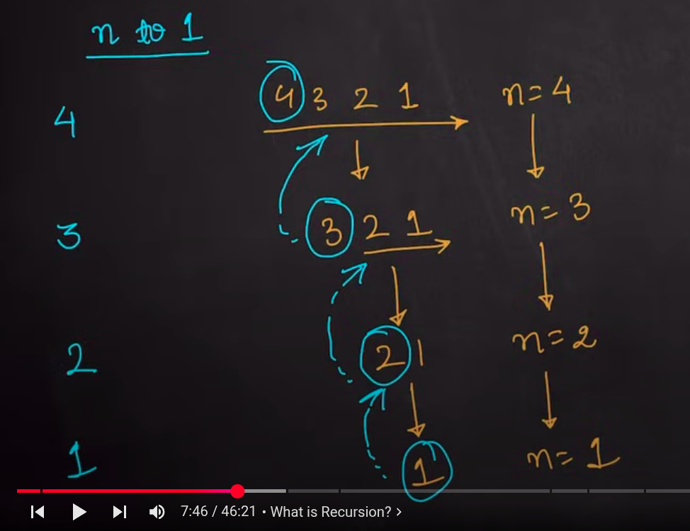

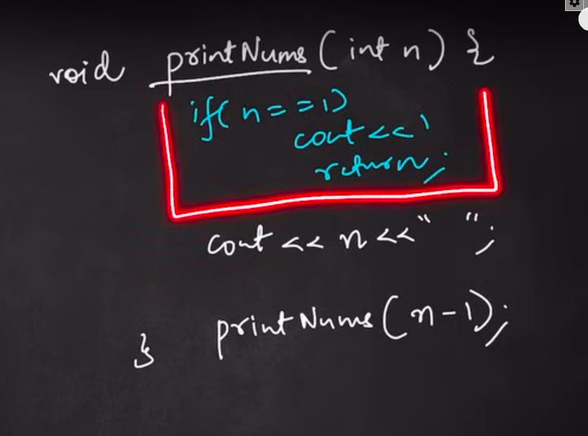

#### [Print Nums recursive example](./03-print-num-example.cpp)

## Recursion in memory

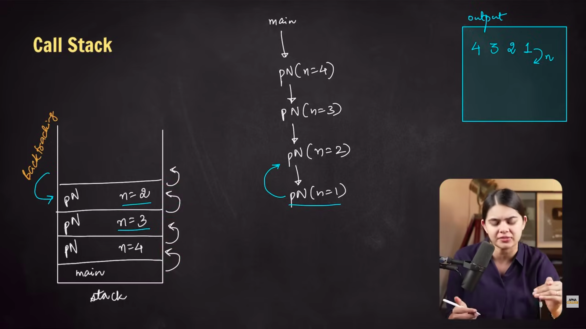

-   backtracking: going back the way we came from

-   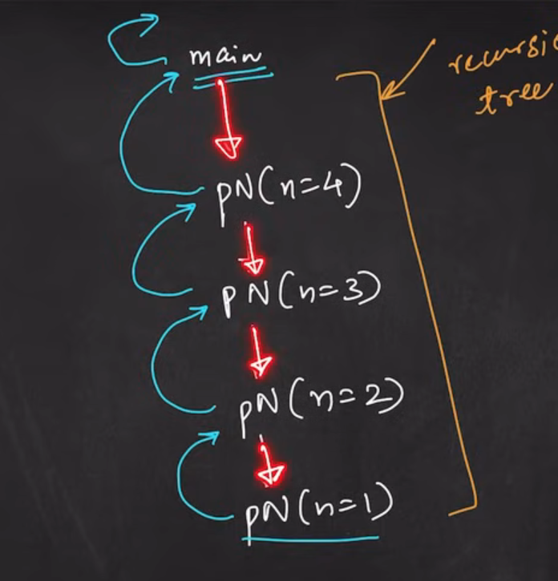
-   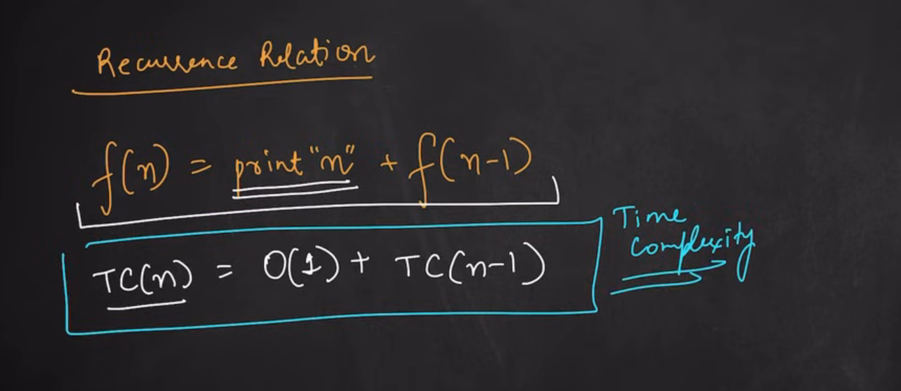
-

#### Factorial

-   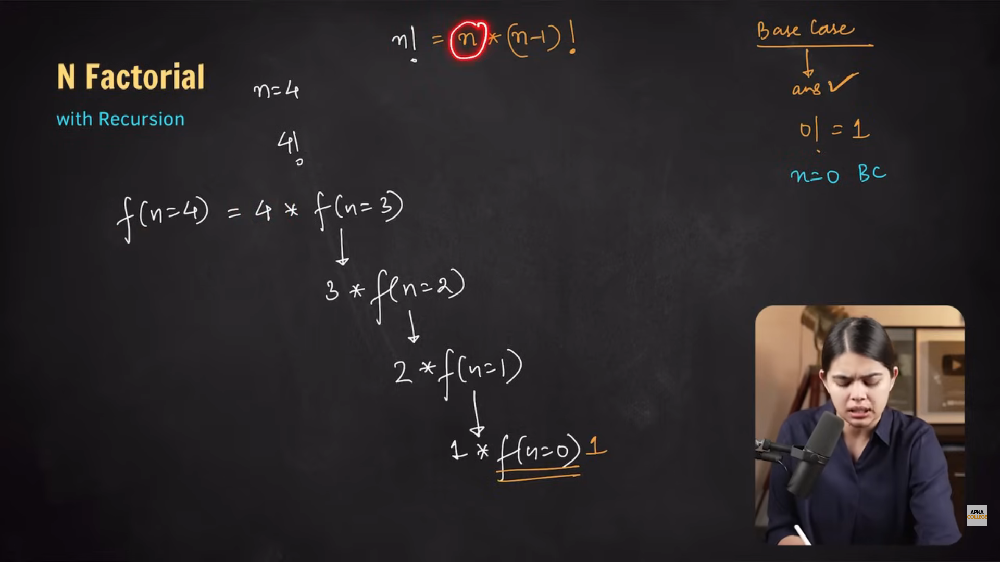
-   [Factorial program](./08-factorlial.cpp)
-

## Time Complexity

-   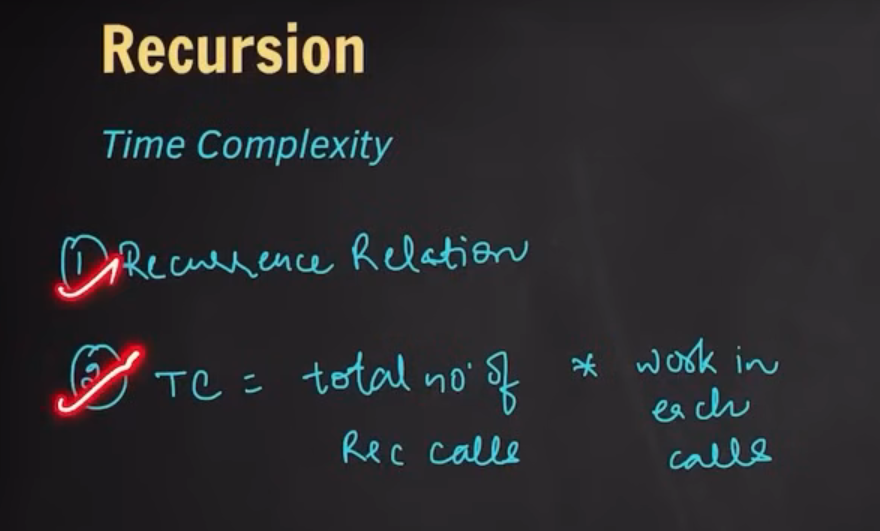

-   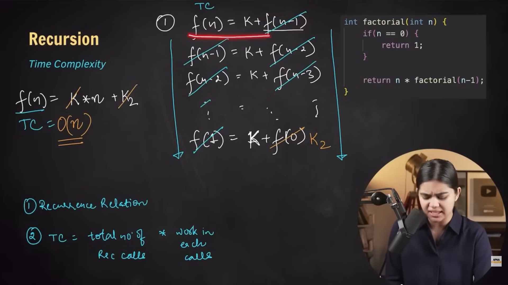

-   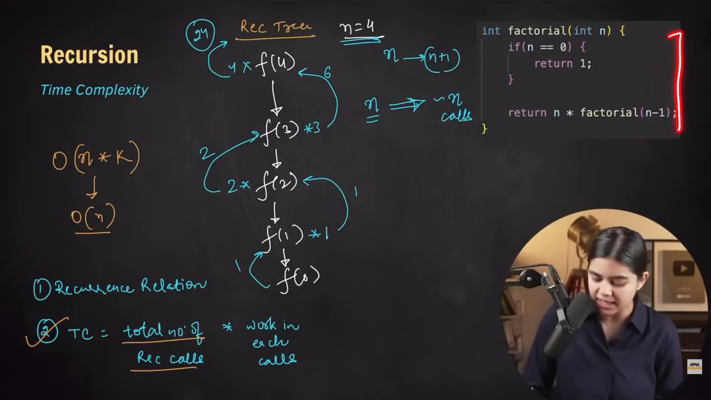

## Space Complexity

-   [Sum of n by recursion](./13-sum-of-n-nums.cpp)
-   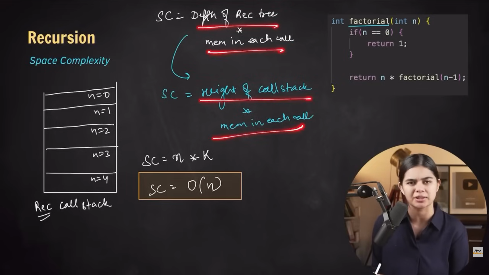

- [Fibonacci by recursion](./14)