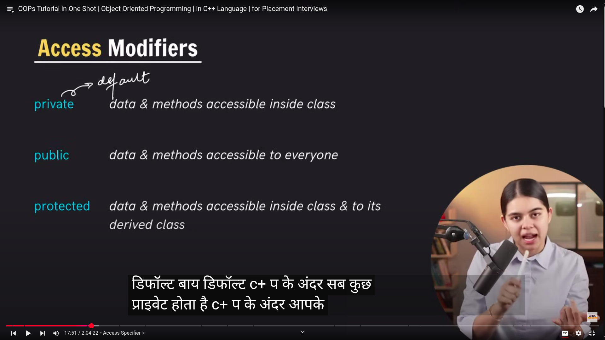
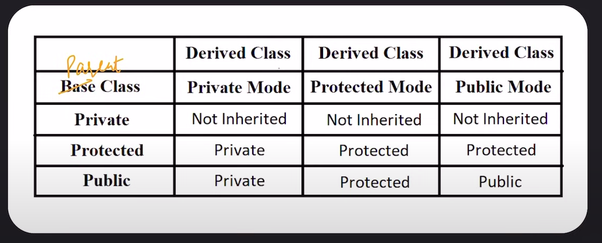

# Object Oriented Programming

Video Link: https://www.youtube.com/watch?v=mlIUKyZIUUU&list=PLfqMhTWNBTe137I_EPQd34TsgV6IO55pt&index=58

#### Access Modifiers



Default is private

Private not inherited, protected are

```cpp
// Getter function get private values,
// Setter set them
```

## 4 Main things in OOPs

-   Encapsulation
-   Abstraction
-   Inheritance
-   Polymorphism

#### Encapsulation

Encapsulation is wrapping up of data & member functions in a single unit called class

> data + member functions
> Capsule is class in this

**Helps in Data hiding**
Make sensitive info private

**--> Constructor**
- [Constructor Destructor Example](./03-constructor-destructor-example.cpp)
- Special method invoked automatically at the time of object creation.
- (Used for initialization)

- Class is a blueprint that doesn't get much memory
- Objects get memory

**Properties**
-   Name same as that of class
-   No return type
-   Called only once (automatically) at creation (Always public, called by others)
-   Memory allocation happens when constructor is calledA

-   Can be overloaded (ex of polymorphism)

**Types of constructor**

-   Parameterized
-   Non Parameterized
-   Copy

**this**
<br>
**this** points to the current object, created automatically

[This example file](./02-this-example.cpp)

**Default copy constructor** Takes the object of same class as parameter
(pass by reference, actual memory address, [i.e. & Class_obj])
makes a copy

**Shallow Copy** - (Default copy constructor) Copies all the member values

-   Problems when doing dynamic memory allocations (using "new" keyword)
-   Basically copies the pointers of addresses in different object
-   (different objects start pointing to same memory, changes in one that shouldn't affect the original start doing)

> Dynamic memory allocation allocates memory in heap instead of stack

**Deep Copy** - Has to be created manually

**--> Destructor**

```cpp
~/ClassName(){}
```

called automatically (when the object gets out of scope)
deallocate memory (has to be created manually if class has dynamic memory allocation)

Dynamically allocated memory has to be deallocated dynamically (created by "new", deleted by "delete")

Prevent Memory leak (unused memory which is never unallocated)

```cpp
// Dynamic memory allocation and deallocation
int* ptr = new int; // Or new int
delete ptr; // frees the memory the pointer points to
```

**Parameterized constructor**

#### Inheritance

When **properties and base functions** of parent class are **passed** on to the derived class
Used for code reusability

Class A (parent, base)
|
|
|
˅
Class B (child, derived)

Parent class constructor is called first, then derived class
Vice versa for destructors

[Parameterized constructors example](./04-parameterized-constructor.cpp)

**Modes of inheritance**


**Types of Inheritance**

-   Single Inheritance: Inheritance from base to derived (parent to child)

```
Class A
    |
    |
    |
    ˅
Class B
```

-   Multi Level Inheritance: Multiple levels

```
  Parent
    |
    |
    |
    ˅
  Parent
    |
    |
    |
    ˅
  Child
```

-   Multiple Inheritance: Two parents and a single child class

```
  Parent  Parent
    |       |
    |       |
    |       |
    ˅       ˅
    ---------
        |
        |
        |
        ˅
      Child
```

-   Hierarchial Inheritance: Multiple classes inherit from a single class

```
        Parent
          |
          |
          |
          ˅
    -------------
    |           |
    |           |
    |           |
    ˅           ˅
  Child       Child
```

-   Hybrid Inheritance: A mix of all previous

```
            Person
              |
              |
              |
              ˅
        -------------    # Hierarchial Inheritance
        |           |
        |           |
        |           |
        ˅           ˅
     Student     Teacher  # Multi Level Inheritance
        |           |
        |           |
        |           |
        ˅           ˅
    Grad student    TA

```

#### Polymorphism

The ability of an object to take on different forms or behave in different ways depending on the context in which they are used.

-   **Compile Time Polymorphism**

**Function overloading** - Same function different parameters
happens statically

**Operator overloading** (\*, +, -, = etc)
[06-operator-overloading-vector-example.cpp](./06-operator-overloading-vector-example.cpp)

-   **Run Time Polymorphism**
    Dynamic Polymorphism

**Function overriding**
(inheritance)

**Virtual Functions** - Expected to be redefined in the inherited class, determined by the actual type of the object at runtime (not pointer time)
[06-virtual-functions example](./06-virtual-functions.cpp)

#### Abstraction

Hiding all the unnecessary details, and only showing important parts

**Data hiding** - data hiding means hiding things, and abstraction means hiding some parts but showing important ones

**Abstract classes** - Used to provide a base from which other classes can be defined - Cannot be and are not meant to be, instantiated - Define an interface for the derived class

**Static Variables**
In functions - Created and initialized once for the lifetime of a program, same variable used when functions is called again, not initialized over and over again

```cpp
void fun() {
    static a = 0;
    cout << "a: " << a << endl;
}

int main() {
    fun(); // 0
    fun(); // 1
    fun(); // 2
    return 0;
}
```


In class - created & initialized once and shared by all objects of the class 
```cpp
class A {
    public:
    static int a;

    void incA() {
        a++;
        cout << a << endl;
    }
};

int main() {
    A obj1, obj2;
    obj1.a = 0; // init
    obj1.incA(); // 1
    obj2.incA(); // 2
    return 0;
}
```

**static objects** - once created remain for the lifetime of the program
- [Static object example](./08-static-obj.cpp)

##### Friend function and friend class

- friend functions and friend classes allow access to the private and protected members of a class, even though they are not member functions or derived classes.
- This can be useful when you want to allow a specific function or another class to access internal details of your class without exposing them to the entire world.

- Properties:
    - Friendship is not mutual. A is a friend class of B, B is not automatically friend of A
    - Friendship is not derived. Children are not automatically friends if parents are.
    - Use sparingly, breaks encapsulation & tightens coupling b/w classes

```cpp
// Friend function
#include <iostream>
using namespace std;

class Box {
private:
    int width;

public:
    Box(int w) : width(w) {}

    // Declare friend function
    friend void printWidth(Box b);
};

// Friend function definition
void printWidth(Box b) {
    // Can access private member of Box
    cout << "Width: " << b.width << endl;
}

int main() {
    Box box1(10);
    printWidth(box1);  // Calls the friend function
    return 0;
}
```

```cpp
// Friend class
class B; // Forward declaration

class A {
    friend class B; // Declare B as a friend class
    private:
        int secret = 42;
};

class B {
    public:
        void revealSecret(A a) {
            cout << "A's secret is: " << a.secret << endl;
        }
};
```

[MCQ questions](./09-mcqs.md)