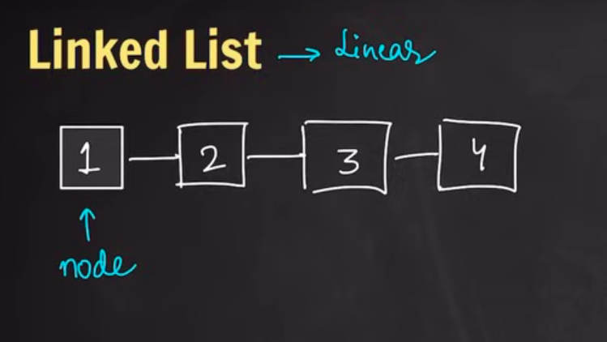
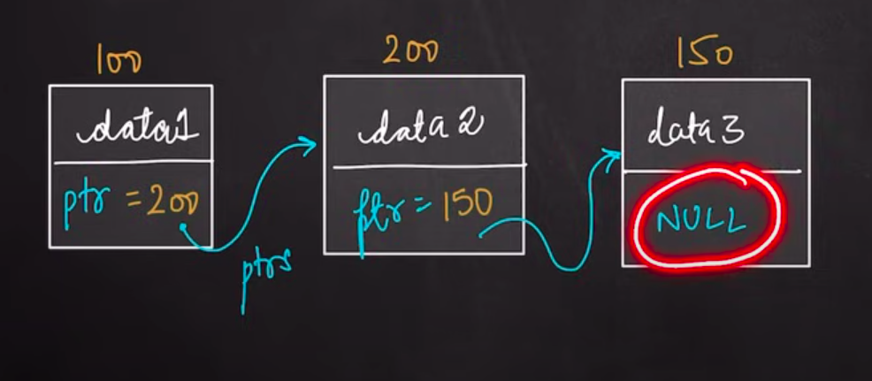
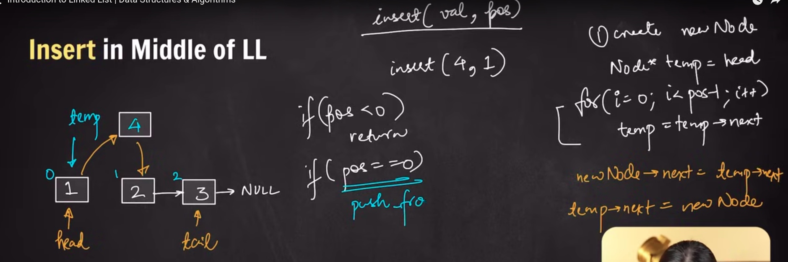

# Linked List

#### About:
- Array and vectors are contiguous, while LL is non contiguous
- Visualized as a linear data structure
- Dynamically resizable 
- O(n) time complexity for access to any element

List in STL has already implemented this kind of data structure

#### Details

- Contains of linked nodes
- In simple linked list Each node contains 2 things, data and pointer to next node
- Last pointer has NULL
- HEAD pointer points towards the first node in list
- (TAIL pointer is also used in Doubly linked list)

#### Note
- Use new keyword to create nodes, they should persist even after the node creation function code block ends 
- (which doesn't happen for static data)

[Linked List](./03-linked-list.cpp)

