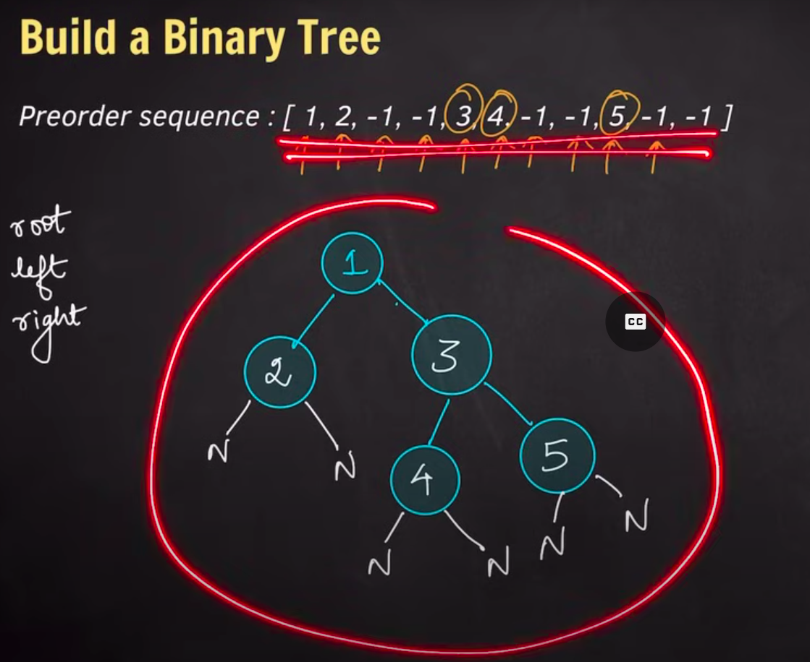
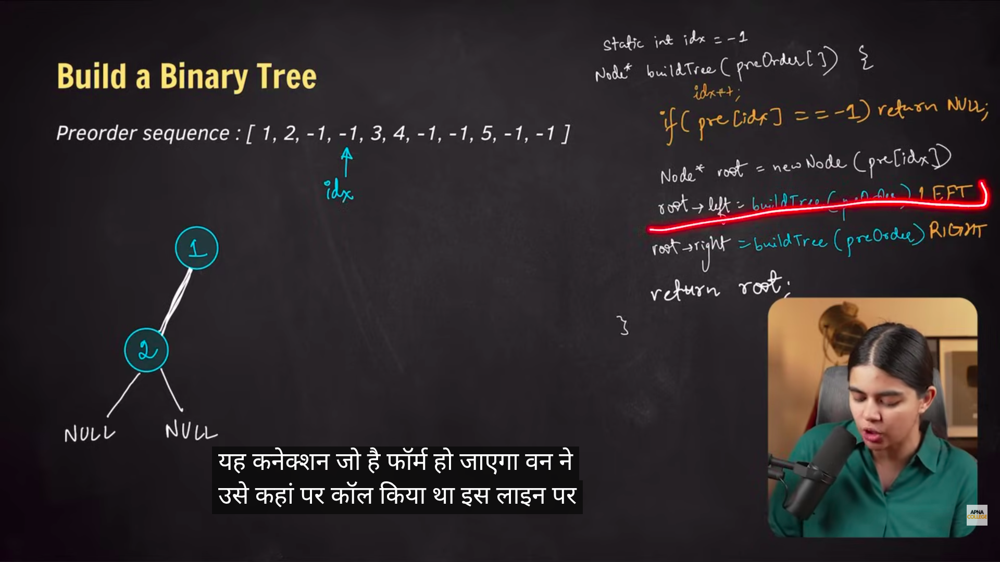
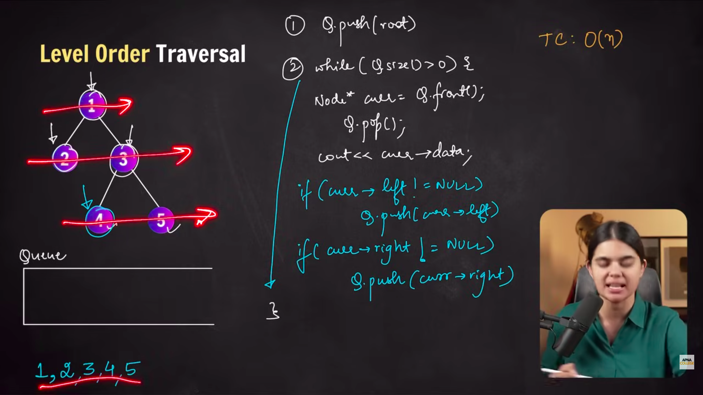

# Linear & Hierarchical Data structures

Linear data structure: Array, Linked List

Hierarchical Data structure: Trees

-   **Binary tree:** Each node has at max two child nodes

## General sol

```

solve(root) {
    solve(left subtree)
    solve(right subtree)

    calculate solution for the root
}
```

-   [basic binary tree definition](./0-basic-binary-tree.cpp)

#### Pre order sequence

-   

-   [Build a binary tree from pre-order sequence](./0-basic-binary-tree.cpp)

-   

#### Tree traversal

-   Pre order traversal (visit root first)
-   In order traversal (visit left subtree first)
-   Post order traversal (visit left, right, root)
-   Level order (Nodes on each level then on next etc, Iterative Approach, with queue)

-   DFS (Depth First Search): Travel all nodes of Each Branch first, then next and so on
-   BFS (Breadth First Search): Travel all nodes which are nearest on the same level first then on the next

    -   (Basically Level order traversal in case of tree)

-   
